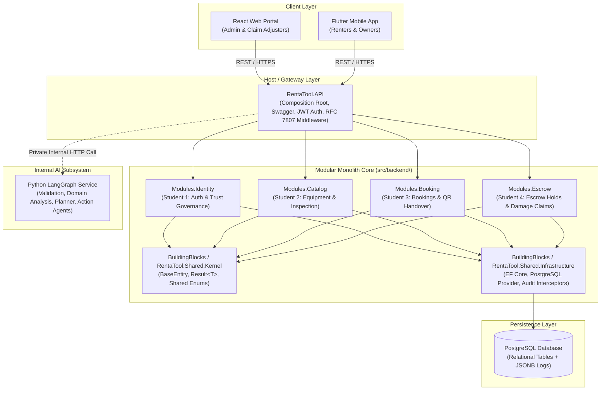

# RentaTool LK – Backend Architecture Documentation

> **Project**: RentaTool LK – Peer-to-Peer Machinery & Equipment Rental System  
> **Module**: SE3090 Software Engineering Frameworks (Year 3, Semester 1 | 2026)  
> **Architecture Style**: **Modular Monolith Architecture**  
> **Target Framework**: .NET 9.0 (`net9.0`) / ASP.NET Core Web API  
> **Primary Database**: PostgreSQL (Entity Framework Core)

---

## 1. Architectural Style & Design Philosophy

RentaTool LK utilizes a **Modular Monolith Architecture**. Rather than deploying fragmented microservices that introduce distributed transaction overhead, network latency, and deployment complexity, all four core business domains are structured as **independent, loosely-coupled modules** residing inside a single ASP.NET Core solution and executed by a single unified host process.

### Key Architectural Tenets:
1. **Strict Module Encapsulation**: Each module manages its own Domain, Application logic, Infrastructure/Persistence configurations, and API Controllers.
2. **Zero Cross-Module Project References**: Business modules **do not reference each other** directly. For instance, `RentaTool.Modules.Booking` cannot reference `RentaTool.Modules.Catalog` or `RentaTool.Modules.Identity`.
3. **Shared Building Blocks**: Cross-cutting concerns, shared domain primitives (`BaseEntity`, `Result<T>`, `Enums`), and shared infrastructure (EF Core PostgreSQL provider, audit interceptors) live in `BuildingBlocks`.
4. **Single Deployable Unit**: `RentaTool.API` acts as the Monolith Host (Composition Root) that registers, configures, and routes all modules.

---

## 2. High-Level Architecture Diagram



---

## 3. Solution Structure & Project Layout

```text
src/backend/
├── RentaTool.sln                           # Visual Studio / .NET Solution File
│
├── Host/
│   └── RentaTool.API/                     # Monolith Host & Composition Root
│       ├── Controllers/                   # Root health check and system diagnostic endpoints
│       ├── Middleware/                    # Global Exception Handler (RFC 7807 ProblemDetails)
│       ├── Extensions/                    # ServiceCollection extensions for module registration
│       ├── appsettings.json               # Database connection strings & JWT settings
│       └── Program.cs                     # Main entrypoint, CORS, Swagger, and middleware pipeline
│
├── BuildingBlocks/
│   ├── RentaTool.Shared.Kernel/           # Zero-dependency Core Domain Primitives
│   │   ├── Domain/                        # BaseEntity.cs, Enums.cs (UserRole, RentalStatus, etc.)
│   │   ├── Models/                        # Result.cs, Result<T>.cs, PagedList.cs
│   │   └── Exceptions/                    # DomainException.cs, NotFoundException.cs
│   │
│   └── RentaTool.Shared.Infrastructure/   # Reusable Infrastructure Components
│       ├── Persistence/                   # Base DbContext, Audit Interceptors, PostgreSQL SnakeCase
│       └── Security/                      # CurrentUser provider, Password hash interfaces
│
└── Modules/
    ├── Identity/                          # [COMPONENT 1 - Student 1]
    │   └── RentaTool.Modules.Identity/
    │       ├── Domain/                    # User, UserRole, KYCRecord, TrustLedger
    │       ├── Application/               # RegisterDto, LoginDto, TokenService, TrustScoreService
    │       ├── Infrastructure/            # Identity entity EF Core configurations
    │       └── Controllers/               # AuthController.cs, UsersController.cs
    │
    ├── Catalog/                           # [COMPONENT 2 - Student 2]
    │   └── RentaTool.Modules.Catalog/
    │       ├── Domain/                    # Equipment, Category, InspectionLog, ToolImage
    │       ├── Application/               # EquipmentDto, InspectionLogDto, AvailabilityChecker
    │       ├── Infrastructure/            # Catalog entity EF Core configurations
    │       └── Controllers/               # EquipmentController.cs
    │
    ├── Booking/                           # [COMPONENT 3 - Student 3]
    │   └── RentaTool.Modules.Booking/
    │       ├── Domain/                    # Booking, HandoverEvent, GeoLocation, BookingSchedule
    │       ├── Application/               # BookingDto, HandoverTokenService, ScheduleValidator
    │       ├── Infrastructure/            # Booking entity EF Core configurations
    │       └── Controllers/               # BookingsController.cs
    │
    └── Escrow/                            # [COMPONENT 4 - Student 4]
        └── RentaTool.Modules.Escrow/
            ├── Domain/                    # EscrowHold, DamageClaim, Payment, WorkflowStateAudit
            ├── Application/               # EscrowDto, ClaimDto, SettlementService, AdjudicationHandler
            ├── Infrastructure/            # Escrow entity EF Core configurations, AI client adapter
            └── Controllers/               # EscrowController.cs, ClaimsController.cs
```

---

## 4. 4-Student Component Allocation & Technical Boundaries

To satisfy the **SE3090 Individual Contribution Rubric (70 Individual / 30 Group)**, each student owns one full business component end-to-end:

| Component ID | Owner | Business Domain & API Endpoints | Database Entities | AI Agent Ownership |
| :--- | :--- | :--- | :--- | :--- |
| **`COMPONENT_1`** | **Student 1** | **User Identity, Verification & Trust Governance**<br>• `POST /api/v1/auth/register`<br>• `POST /api/v1/auth/login`<br>• `POST /api/v1/users/kyc`<br>• `GET /api/v1/users/{id}/trust-score`<br>• `PATCH /api/v1/users/{id}/verification-status` *(Business-Specific)* | `Users`<br>`UserRoles`<br>`KYCRecords`<br>`TrustLedger` | **Validation / Safety Agent**<br>(Input sanitizer, blacklist check, deposit cap enforcement, prompt injection defense) |
| **`COMPONENT_2`** | **Student 2** | **Equipment Catalog & Asset Condition Inspection**<br>• `POST /api/v1/equipment`<br>• `GET /api/v1/equipment`<br>• `POST /api/v1/equipment/{id}/inspection-logs`<br>• `GET /api/v1/equipment/{id}/history`<br>• `POST /api/v1/equipment/batch-availability` *(Business-Specific)* | `Equipment`<br>`Categories`<br>`InspectionLogs`<br>`ToolImages` | **Domain Analysis Agent**<br>(Visual delta inspection, wear-and-tear vs accidental structural damage classifier) |
| **`COMPONENT_3`** | **Student 3** | **Booking Engine & Handover Verification**<br>• `POST /api/v1/bookings`<br>• `GET /api/v1/bookings/active`<br>• `POST /api/v1/bookings/{id}/generate-handover-token`<br>• `POST /api/v1/bookings/{id}/verify-handover`<br>• `POST /api/v1/bookings/{id}/extend-schedule` *(Business-Specific)* | `Bookings`<br>`HandoverEvents`<br>`GeoLocations`<br>`BookingSchedules` | **Coordinator / Planner Agent**<br>(Orchestrates sequential verification plan, manages multi-step state graph) |
| **`COMPONENT_4`** | **Student 4** | **Escrow Ledger & Security Deposit Claims**<br>• `POST /api/v1/escrow/pre-authorize`<br>• `POST /api/v1/claims`<br>• `GET /api/v1/claims/{id}`<br>• `POST /api/v1/claims/{id}/payout`<br>• `POST /api/v1/claims/{id}/adjudicate` *(Business-Specific)* | `EscrowHolds`<br>`DamageClaims`<br>`Payments`<br>`WorkflowStateAudit` | **Action / Tool Agent**<br>(Executes allow-listed repair calculation tools: `GetEquipmentReplacementCost`, `CalculateRentalWearFactor`) |

---

## 5. Persistence Strategy: Relational + JSONB Hybrid Model

In accordance with PRD ADR-04:
- **Financial & Relational Integrity**: Financial records, user accounts, and equipment bookings are stored in normalized relational PostgreSQL tables with foreign key constraints, unique indexes, and optimistic concurrency tokens.
- **Durable AI State & Audit Logs**: The `WorkflowStateAudit` and `InspectionLogs` tables utilize PostgreSQL **`jsonb`** columns:
  - Preserves full agent execution plans, tool parameters, prompt snapshots, and confidence metrics.
  - Allows the AI schema to evolve without requiring recurring relational database schema migrations.
  - Supports PostgreSQL JSON query operators (`->>`, `@>`) for audit analysis.

---

## 6. Security & Cross-Cutting Concerns

1. **Authentication & Authorization**:
   - Industry-standard **JWT (JSON Web Token)** with Bearer authentication scheme.
   - Role-Based Access Control (**RBAC**) enforcing roles: `Renter`, `Owner`, and `Admin`.
2. **Standardized Error Handling**:
   - Global exception middleware maps exceptions to **RFC 7807 ProblemDetails** format, ensuring consistent `{ status, title, detail, errors, traceId }` error payloads across all endpoints.
3. **Cross-Origin Resource Sharing (CORS)**:
   - Configured in `Host/RentaTool.API` to authorize calls from the React Web portal (`http://localhost:5173`) and mobile clients.
4. **OpenAPI / Swagger UI**:
   - Interactive endpoint documentation enabled at `/swagger` with Bearer token authentication input for direct API testing during development and viva demonstrations.

---

## 7. Local Development & Quickstart Guide

### Prerequisites
* [.NET 9.0 SDK](https://dotnet.microsoft.com/download)
* [Docker Desktop](https://www.docker.com/products/docker-desktop/) (for local PostgreSQL)

### 1. Start Local PostgreSQL Database
From the repository root (`RentaTool/`):
```bash
docker compose up -d
```
This launches a PostgreSQL 16 container on `localhost:5432` with database `rentatool_db`.

### 2. Restore Dependencies & Build Solution
From `src/backend/`:
```bash
dotnet restore RentaTool.sln
dotnet build RentaTool.sln
```

### 3. Run the Backend API Host
From `src/backend/`:
```bash
dotnet run --project Host/RentaTool.API
```
* **API Root**: `http://localhost:5000` or `https://localhost:5001`
* **Interactive Swagger UI**: `http://localhost:5000/swagger`
* **Health Check**: `http://localhost:5000/health`

### 4. Run Automated Tests
```bash
dotnet test
```

---

## 8. Team Collaboration & Git Branching Rules

To ensure clean Git histories and individual contribution evidence:
* **`main`**: Production releases only (Protected).
* **`dev`**: Working integration branch (Protected).
* **Feature Branches**:
  * Student 1: `feature/comp1-auth-trust`
  * Student 2: `feature/comp2-catalog-inspection`
  * Student 3: `feature/comp3-booking-handover`
  * Student 4: `feature/comp4-escrow-claims`
* **Rule**: All modifications must occur on your assigned feature branch. Code must be merged into `dev` via reviewed Pull Requests with successful build checks.
